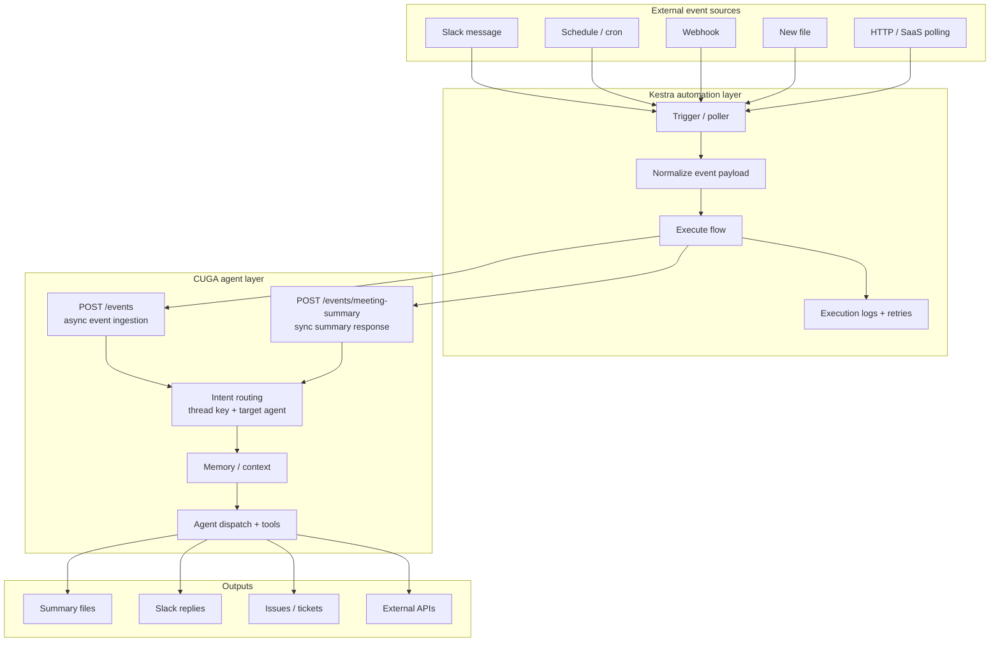

# CUGA Event Automation Architecture Diagram

This diagram shows the current event automation proof of concept:

- Kestra owns trigger mechanics, polling, flow execution, retries, and logs.
- CUGA owns event normalization semantics, agent intent, memory, routing, and summary generation.
- The file-summary smoke test uses a scheduled Kestra poller because the local file trigger did not fire reliably in the Docker runtime.

## Current File Summary Flow

```mermaid
flowchart LR
    transcript["Meeting transcript<br/>*.txt in inbox"] --> poller["Kestra schedule trigger<br/>polls every minute"]
    poller --> flow["Kestra flow<br/>cuga_file_summary_smoke"]
    flow --> request["HTTP POST<br/>/events/meeting-summary"]
    request --> auth["CUGA bearer auth<br/>CUGA_EVENTS_TOKEN"]
    auth --> summary["CUGA meeting summary handler"]
    summary --> mode{"CUGA_EVENTS_DISPATCH"}
    mode -- "false<br/>deterministic smoke mode" --> deterministic["Deterministic summary<br/>no LLM required"]
    mode -- "true<br/>agent dispatch mode" --> agent["CUGA agent dispatch<br/>memory + tools + LLM"]
    deterministic --> response["Synchronous JSON response<br/>{ summary: markdown }"]
    agent --> response
    response --> outbox["Kestra writes<br/>*.summary.md to outbox"]
    outbox --> processed["Kestra moves transcript<br/>to processed"]
```



Plain-text version:

```text
meeting transcript (*.txt)
        |
        v
Kestra scheduled poller, every minute
        |
        v
Kestra flow: cuga_file_summary_smoke
        |
        v
POST http://host...:7860/events/meeting-summary
Authorization: Bearer $CUGA_EVENTS_TOKEN
        |
        v
CUGA validates token and reads payload.transcript_text
        |
        +--> CUGA_EVENTS_DISPATCH=false: deterministic smoke summary
        |
        +--> CUGA_EVENTS_DISPATCH=true: invoke CUGA agent path
        |
        v
CUGA returns { "summary": "..." }
        |
        v
Kestra writes outbox/<name>.summary.md
        |
        v
Kestra moves inbox/<name>.txt to processed/<name>.txt
```

## General Event Automation Boundary



## Demo Runtime

```text
Terminal 1:
  dotenv -e .env -- uv run cuga start --host 0.0.0.0 demo

Terminal 2:
  dotenv -e .env -- ./scripts/smoke_kestra_file_to_cuga_summary.sh --start-kestra --no-cleanup

Inbox:
  /private/tmp/cuga-kestra-file-summary-smoke/inbox

Outbox:
  /private/tmp/cuga-kestra-file-summary-smoke/outbox

Kestra UI:
  http://127.0.0.1:8081
```
